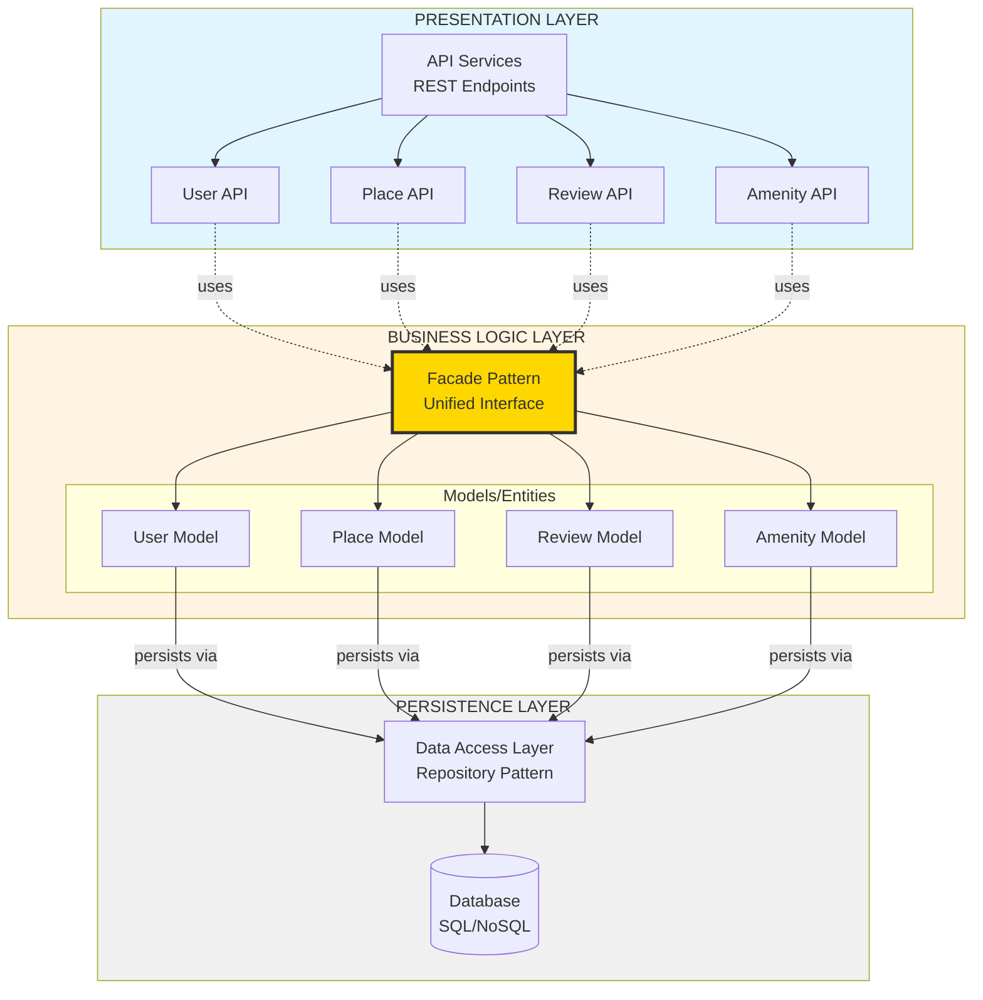

# Task 0: High-Level Package Diagram

## Three-Layer Architecture with Facade Pattern



## Architecture Explanation

### Layer Descriptions

#### **Presentation Layer (API Services)**
- **Purpose**: Handle HTTP requests/responses and client communication
- **Responsibilities**:
  - Route incoming requests to appropriate endpoints
  - Validate input data format
  - Serialize/deserialize JSON
  - Handle authentication and authorization
  - Return appropriate HTTP status codes
- **Components**:
  - User API: `/users` endpoints for registration, profile management
  - Place API: `/places` endpoints for listing properties
  - Review API: `/reviews` endpoints for feedback submission
  - Amenity API: `/amenities` endpoints for facility management

#### **Business Logic Layer (Models & Core Logic)**
- **Purpose**: Implement business rules and domain logic
- **Responsibilities**:
  - Define entity models and relationships
  - Validate business rules
  - Execute business operations
  - Manage entity lifecycle
- **Components**:
  - **Facade**: Provides unified interface between Presentation and Business Logic
  - **User Model**: User management and authentication
  - **Place Model**: Property listing management
  - **Review Model**: Review and rating logic
  - **Amenity Model**: Amenity management

#### **Persistence Layer (Data Access)**
- **Purpose**: Handle data storage and retrieval
- **Responsibilities**:
  - Execute database queries
  - Manage transactions
  - Handle connections
  - Ensure data integrity
- **Components**:
  - **Repository Pattern**: Abstract data access logic
  - **Database**: Physical data storage (SQL/NoSQL)

### Communication Flow

1. **Request Flow** (Top → Down):
   ```
   Client → API Endpoint → Facade → Model → Repository → Database
   ```

2. **Response Flow** (Bottom → Up):
   ```
   Database → Repository → Model → Facade → API Endpoint → Client
   ```

### Design Patterns Used

#### **Facade Pattern**
- **Purpose**: Simplify communication between layers
- **Benefits**:
  - Single entry point for business operations
  - Reduced coupling between layers
  - Easier to test and maintain
  - Clear separation of concerns

#### **Repository Pattern**
- **Purpose**: Abstract data access logic
- **Benefits**:
  - Centralized data access
  - Easier to swap databases
  - Testable without real database
  - Consistent data operations

### Key Design Decisions

1. **Three-Layer Separation**
   - Each layer has distinct responsibility
   - Changes in one layer don't affect others
   - Independent testing possible

2. **Facade as Mediator**
   - API layer doesn't directly access models
   - All requests go through facade
   - Maintains clean architecture

3. **Repository Abstraction**
   - Models don't know about database details
   - Easy to switch from SQL to NoSQL
   - Supports multiple data sources

## File Information

**Task**: Task 0 - High-Level Package Diagram  
**Deliverable**: Three-layer architecture with Facade pattern  
**Format**: Mermaid diagram  
**Location**: `holbertonschool-hbnb/part1/`
